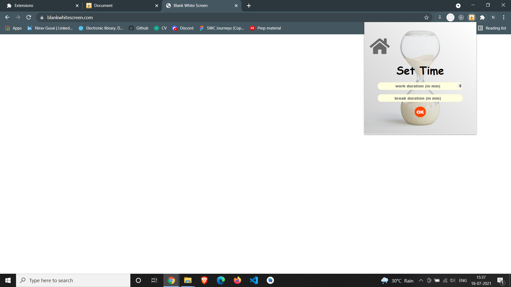
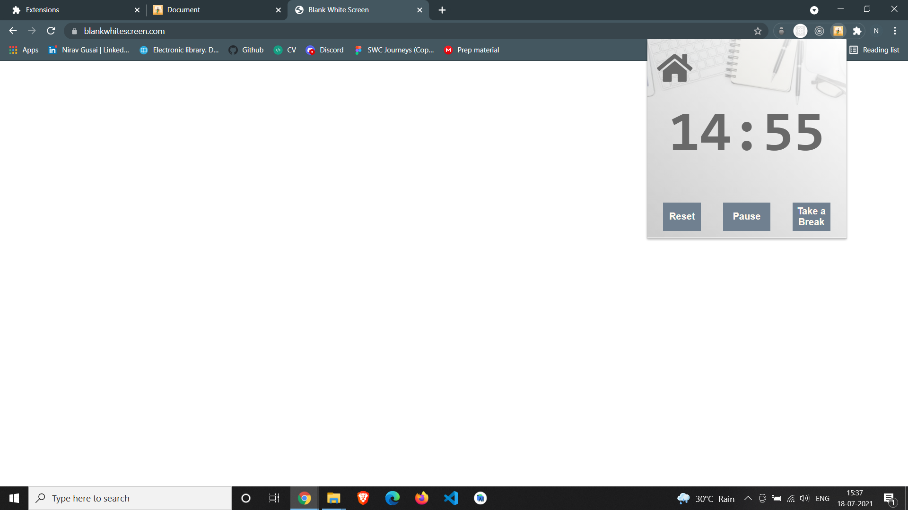
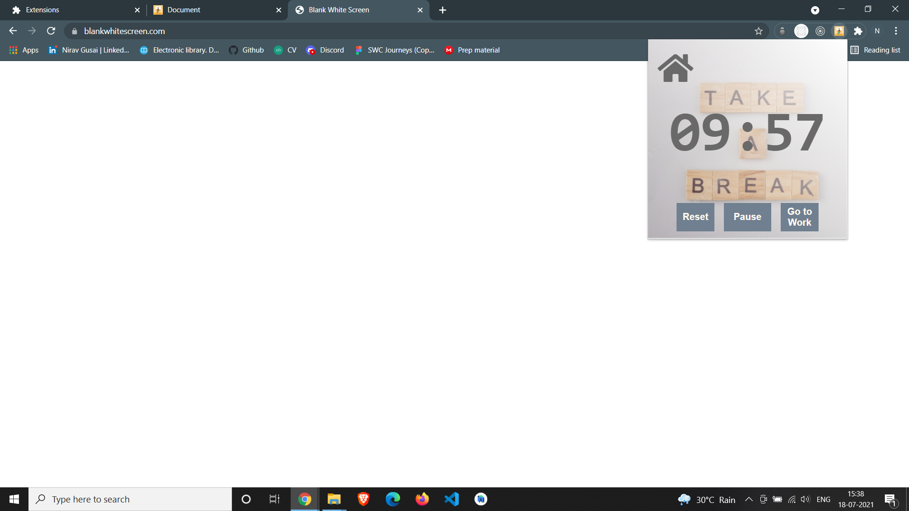
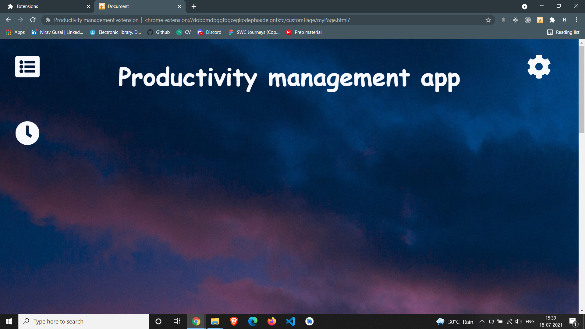
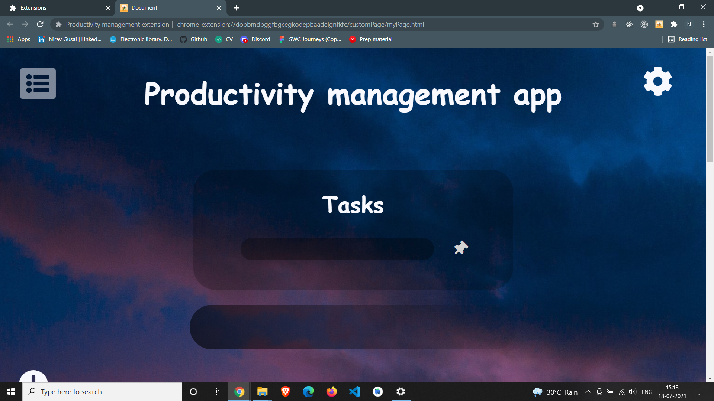
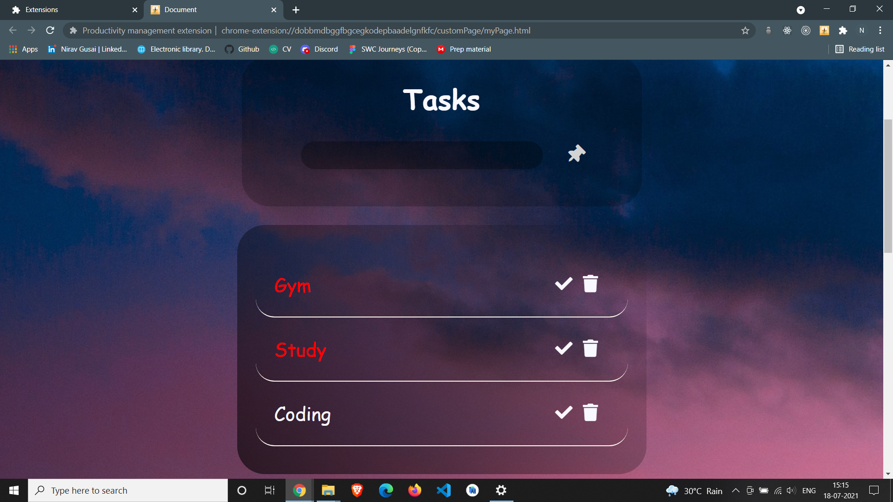
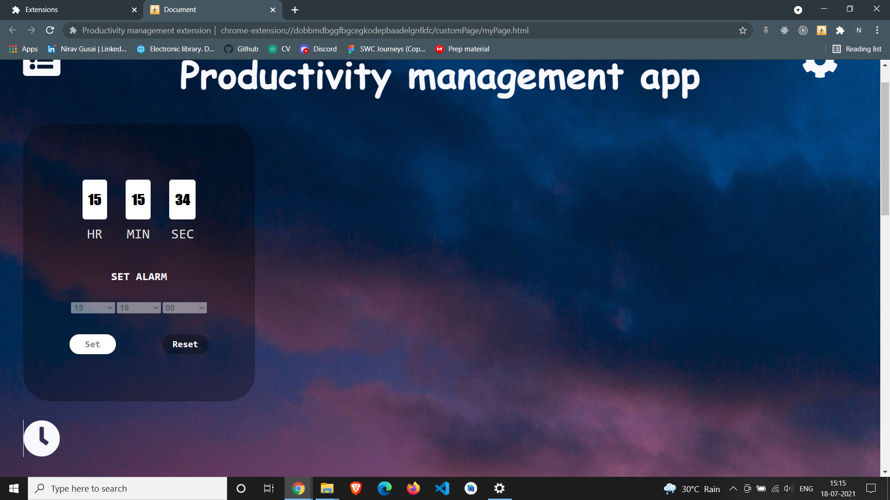
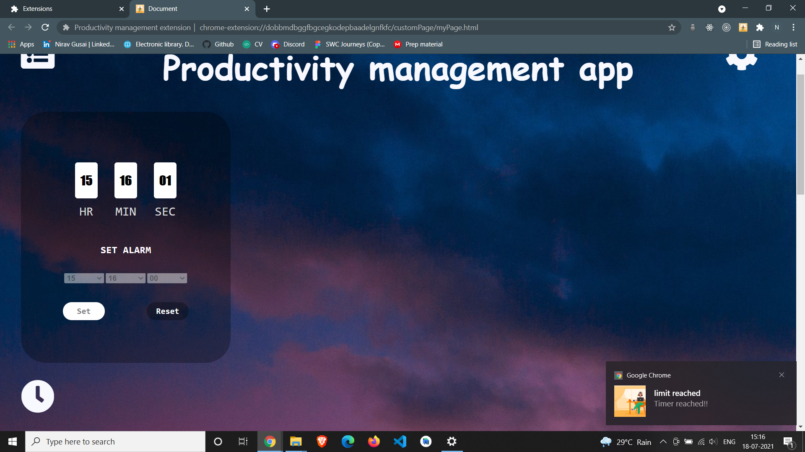

# Description
As a team of 3 developers, we built this chrome extension to help user to track his/her Daily tasks, Work time, Set an Alarm and to block some unnecessary URL's.

# Tech Stack
#### Front-end : `HTML, CSS, jQuery and Javascript`
#### Database : `Chrome's Local storage`

# Guidelines to Setup

1. Clone the project
    ```
    git clone https://github.com/Nirav1510/chrome_extension_demo.git
    ```
2. Connect to Chrome in your PC
* `Load unpack` this repository in extension menu

# Features
It contains **four** features :
1. **To-Do List:** It basically contains your To Do task.
2. **Work Timer:** It basically contains a timer to control your work hours.
3. **Blacklist URLs:** This feature can block any URLs which user want to block.
4. **Alarm:** It shows notification when alarm time is up.

# Screenshots
## Pop-up

## Set-time

## Work-Timer

## Break-Timer

## Landing-Page

## To-do List

## Adding Task
* Completed Task are shown in Red colour

## Alarm

## Alarm Notification

## BlackList URLs
* Web-sites added to the list are not gonna open until you Enable it.


## Authors
- [Utkarsh Kumar](https://github.com/Utk0201)
- [Nirav Gusai](https://github.com/Nirav1510)
- [Utkarsh Patel](https://github.com/utkarshOEE)

**Free Extension, Hell Yeah!**
